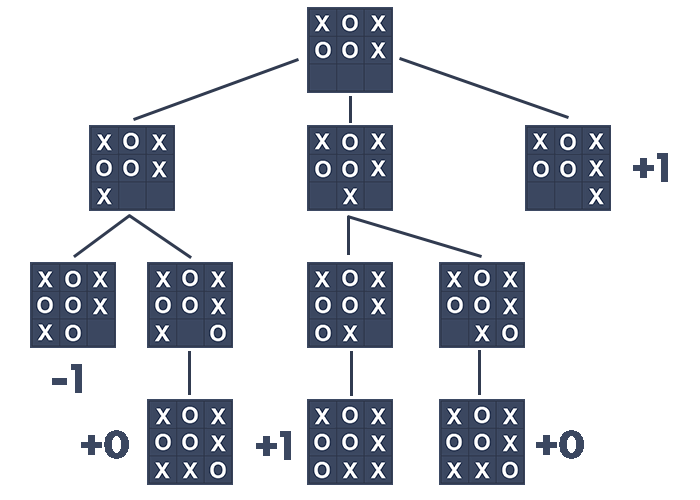

+++
title = 'Unbeatable TicTacToe'
page_type = "project"
date = 2023-01-15T09:00:00-07:00
draft = false
showcaseimage = 'showcase.webp'
github = 'https://github.com/mjpeake/unbeatable-tictactoe'
language-icon = 'fa-java'
filters=["Java","Games"]
+++

An unbeatable game of Tic Tac Toe using a minimax algorithm.

## Features
- Player vs AI Gameplay
- Use of Minimax Algorithm for AI decision-making
- Simple and Intuitive Interface
- Random allocation of Marks
- Random First Move allocation
- Score Counter

## AI Logic (Minimax)
Minimax is used in order to determine the best move for the Computer. It does this by simulating all moves the computer and player could make, in order to find all possible outcomes of the game. It then picks the best option through the use of an evaluation score.

This can be visualised through the following schema with the AI playing as X:

In this example, the algorithm determines that placing a mark in the bottom right corner is the best move. This is because the move will lead to an immediate win for the AI.